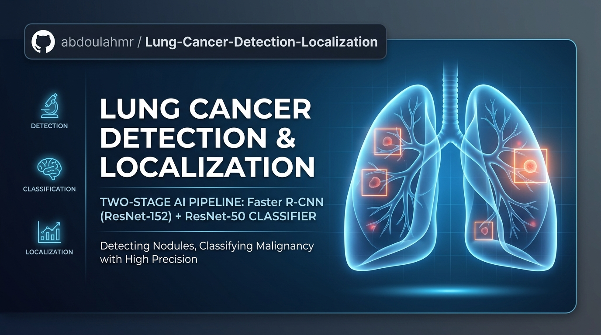
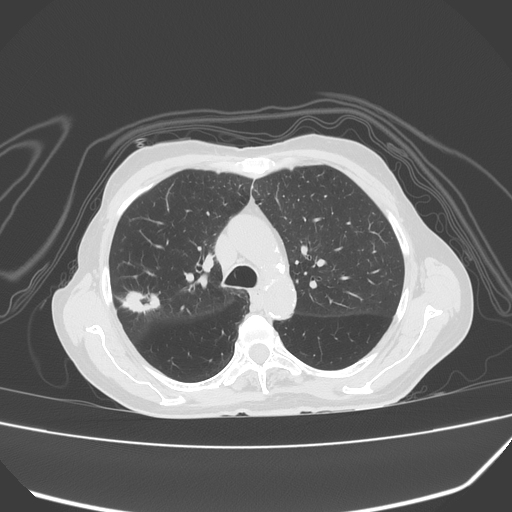
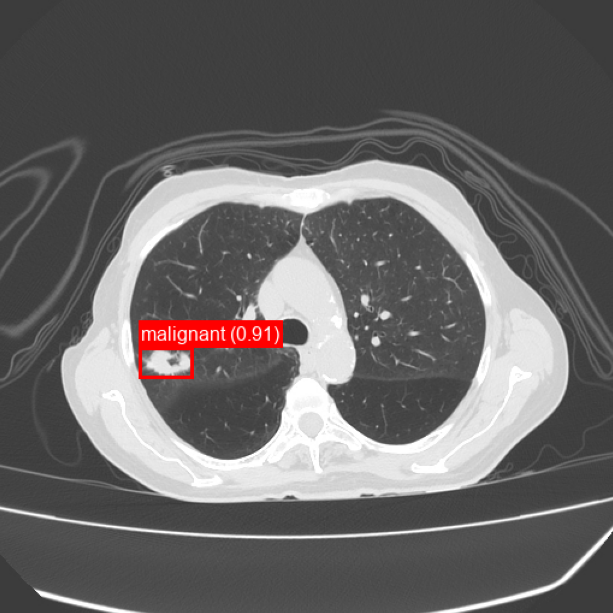

<h3 align="center"><b>Lung Cancer Detection & Localization</b></h3>


[](../LICENSE)

A two-stage deep learning pipeline for detecting, localizing, and classifying
lung tumors (nodules) in medical images — built to solve a specific
false-positive problem that a detector-only approach ran into.

## Overview

Object detectors are good at finding *candidate* regions but tend to flag a
lot of false positives — boxes around tissue that only looks tumor-like.
This project fixes that with a **two-step pipeline**:

1. **Detector** — Faster R-CNN with a ResNet-152 + FPN backbone proposes
   bounding boxes for suspicious regions.
2. **Classifier** — a ResNet-50 binary classifier re-inspects every box the
   detector proposes and decides whether it's a real finding (and whether
   it's benign or malignant), rejecting the ones that aren't.

At inference time, both models use an **adaptive confidence threshold**:
detection/classification thresholds start high (0.9) and relax in steps of
0.05 down to a floor of 0.05 until at least one confident detection
survives. This keeps precision high on easy cases while still recovering
faint findings on harder ones.

## Results

Evaluated on a held-out validation set (IoU ≥ 0.5 counts as a match):

| Metric | Value |
|---|---|
| Precision | **0.8734** |
| Recall | **0.9979** |
| F1-Score | **0.9315** |
| Mean IoU | **0.8104** |

Recall near 1.0 confirms the detector almost never misses a true nodule. The
classifier stage is what lifts precision from a false-positive-heavy
detector-only baseline up to ~0.87.

## Pipeline

```
Image ──► Faster R-CNN (ResNet-152 + FPN) ──► candidate boxes
                                                     │
                                                     ▼
                                        crop each box, resize to 224×224
                                                     │
                                                     ▼
                                     ResNet-50 classifier ──► keep / reject
                                                     │
                                                     ▼
                                   final boxes + benign/malignant labels
```


## Data format

Expects PASCAL VOC–style annotations:

```
dataset/
├── JPEGImages/
│   ├── 0001.png
│   └── ...
└── Annotations/
    ├── 0001.xml
    └── ...
```

Each `<object>` in an annotation is labeled `cancer` (mapped to detector
class `1`) or anything else (mapped to class `2`).

## Inference Example

Case courtesy of Ashesh Ishwarlal Ranchod,
<a href="https://radiopaedia.org/?lang=us">Radiopaedia.org</a>.
From the case <a href="https://radiopaedia.org/cases/222172?lang=us">rID: 222172</a>.

<table>
<tr>
<td align="center"><b>Input CT Slice</b></td>
<td align="center"><b>Pipeline Output</b></td>
</tr>
<tr>
<td>

</td>
<td>

</td>
</tr>
</table>

## Notes
- The detector's class labels (`cancer` vs. other) and the classifier's
  labels (`benign` vs. `malignant`) are two separate label spaces — the
  detector decides *where* something is, the classifier decides *what* it
  is (and whether it's real).
- Thresholds (`INITIAL_DET_THRESH`, `INITIAL_CLS_THRESH`, `STEP`,
  `MIN_THRESH`, `NMS_IOU_THRESHOLD`, `IOU_THRESHOLD`) are all defined in one
  place in the notebook's config cell for easy tuning.
